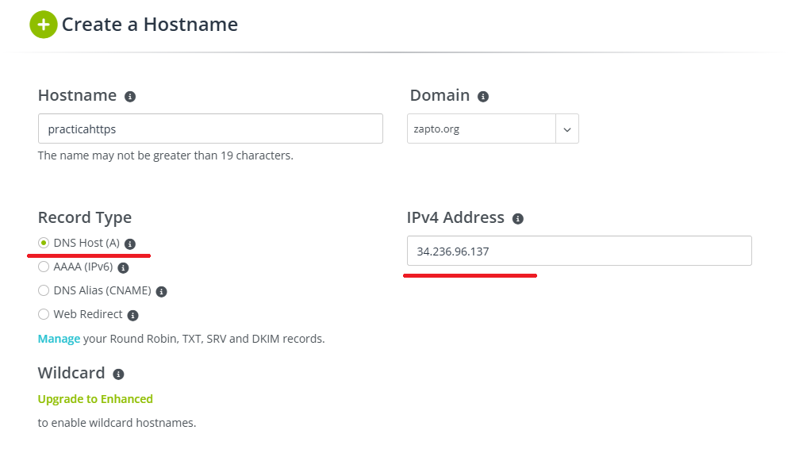
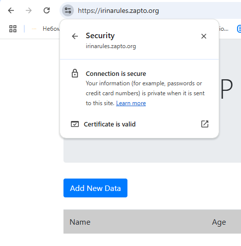

# Tema 1 Practica 5
# HTTPS con Let’s Encrypt y Certbot
**Requisitos:**
* Una instancia de AWS configurada, con una IP pública
* Una pila LAMP instalada en esta instancia
* Una instalación y configuración realizadas de la aplicación LAMP en dicha instancia
<br>


## 1. Registración de un nombre de dominio en No-IP
Configura los registros DNS del proveedor de nombres de dominio (se utiliza [No-IP](https://www.noip.com/)) para que el nombre de dominio de ha registrado pueda resolver hacia la dirección IP pública de una instancia EC2 de AWS.<br>
Tendrá que añadir un registro DNS de tipo A con la dirección IP pública de su instancia EC2 de AWS. Guardalo.


## 2. Instalación y configuración del Certbot
Ve al sitio web de [Certbot](https://certbot.eff.org/) e indique el software y el sistema operativo utilizado para obtener las instrucciones sobre el proceso de instalación de Certbot.
Las instrucciones que estan en este documento se utilizan para el servidor web Apache y el sistema operativo Ubuntu.
**1.** Instala y actualiza ```snapd```.
``` sh
snap install core
snap refresh core
```
**2.**  Elimina la instalación previa de certbot (si existe).
``` sh
apt remove certbot -y
```
**3.** Instala Certbot con ```snapd```.
``` sh
snap install --classic certbot
```
**4.** Crea una alias para el comando ```certbot```.
Crea un enlace simbólico en ```/usr/bin/certbot``` que apunte a la ubicación real de certbot en ```/snap/bin/certbot``` para poder ejecutar el comando certbot desde cualquier ubicación del sistema.
``` sh
ln -fs /snap/bin/certbot /usr/bin/certbot
```
**5.** Obtenga el certificado y configura el servidor.
``` sh
certbot --apache -m $LE_EMAIL --agree-tos --no-eff-email -d $LE_DOMAIN --non-interactive
```
Parametros usados:<br>
```--non-interactive```: hace que el comando se ejecute automáticamente sin la necesidad de ingresar ninguna respuesta manualmente.<br>
```--apache```: especifica que Certbot debe configurar automáticamente un certificado para el servidor web Apache.<br>
```-m $LE_EMAIL```: especifica la dirección de correo electrónico que se utilizará para el registro en Let's Encrypt.<br>
```--agree-tos```: acepta automáticamente los términos de Let's Encrypt.<br>
```--no-eff-email```: desactiva la suscripción al boletín de noticias de la EFF.<br>
```-d $LE_DOMAIN```: especifica el dominio para el cual obtener un certificado.<br>

## 3. Resultado
Ingresa el hostname obtenido en el paso 1 en la barra del navegador y observa el siguiente resultado.

Esto significa que el sitio utiliza una conexión HTTPS segura y el certificado SSL del sitio es válido.